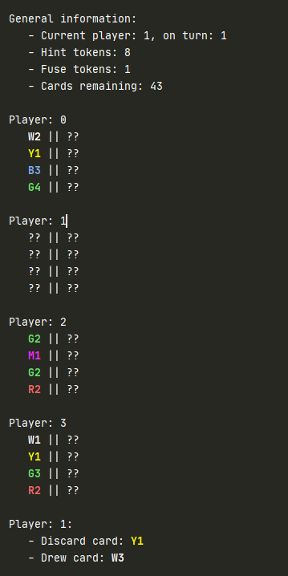

## Hanabi learning environment

A simple Hanabi learning environment for multiple agents.


### Examples

- [x] Basic run example is located in [main.py](main.py).
- [x] Basic unittests


#### Rendering



#### Observation

- Hands: ndarray(num player, hands size, 4))

    a list for every player with the card information in his hands. 

    - Color index: 
    
        * 0 = ?
        * 1 = R(ed)
        * 2 = G(green)
        * 3 = B(lue)
        * 4 = W(hite)
        * 5 = Y(ellow)
        * 6 = M(agenta)
    
    - Card rank:
    
        * 0 = UNKNOWN
        * 1 = ONE
        * 2 = TWO
        * 3 = THREE
        * 4 = FOUR
        * 5 = FIVE
        
    - Informed Color index:
        
        * See color index
        
    - Informed Color rank:
    
       * See rank
       
    Example:
      
     ```
    [[[4 3 0 0]
      [5 2 0 0]
      [5 1 0 0]
      [3 3 0 0]
      [3 3 0 0]]
    
     [[6 4 0 0]
      [5 3 0 0]
      [3 1 0 0]
      [6 1 0 0]
      [2 1 0 0]]]  
      
    ```

- Played: ndarray(num of colors,)
    The current value of the firework stack. Based on the `colors` order (see below)
    
    Example: ```[0 0 0 1 0 0] ```, the White 1 has been placed (4th value in `colors`).
    
    
- Discard: ndarray(num colors, num discards for that color)
    The discard list for every color. Based on the `colors` order (see below)
    
    Example:
    ```
    [[2]     # For Red a 2 has been discarded
     [1, 4]  # For Green a 1 and 4 have been discarded
     [0]     # For Blue no cards have been discarded (0 is a place holder)
     [2]     # For White a 2 has been discarded
     [0]     # For Yellow no cards have been discarded (0 is a place holder)
     [3]]    # For Magenta (Multicolor) the 3 has been discarded (only when using 6 cards)
    ```
  
- Info: dict
    Contains extra information about the hints, fuses, current player and game stats
    
    Example: 
    ```
    { 
      'hints': 0, 
      'fuses': 3, 
      'turns_left': 1, 
      'turns_played': 15, 
      'players': 2, 
      'current_player': 0
    }
    ```

- Moves: tuple((player id, action performed))
    Actions are described in [constants](environment/utils/constants.py) where 
    
    - id
    
       * 0 = Play, card at {index}
       * 1 = Inform color {index}, to player {player}
       * 2 = Inform rank {index}, to player {player}
       * 3 = Discard card at {index}
       
    Example: Player 1, plays the card located at the 5th position in his hand.
    
    ```[(1, <class Actions: (id=0, index=4, player=None)>)]```
    
    
- Colors: ndarray(num colors,)
    
    Define all the colors that are currently in the game and define the color order
    for played cards and discarded cards.
    
    Example:
    
    ```[<Colors.RED: 'R'>, <Colors.GREEN: 'G'>, <Colors.LIGHTBLUE_EX: 'B'>, <Colors.BLACK: 'W'>, <Colors.LIGHTYELLOW_EX: 'Y'>]```


- log: dict(turn, list of performed actions in that turn.)

   example:
    
    ```
    Key: turns log (unpacked dict)

	    - Turn 0: Played card: Y1 Drew card: B1
	    - Turn 1: Played card: R1 Drew card: Y3
	    - Turn 2: Informed player: 0 of rank: 4
	    - Turn 3: Informed player: 0 of rank: 3
	    - Turn 4: Informed player: 0 of rank: 3
	    - Turn 5: Informed player: 1 of rank: 2
	    - Turn 6: Tried to play card: B3, but was not possible Drew card: B4
	    - Turn 7: Discard card: G1 Drew card: W3
	    - Turn 8: Informed player: 0 of rank: 3
	    - Turn 9: Tried to play card: W3, but was not possible Drew card: R3
	    - Turn 10: Informed player: 0 of rank: 4
	    - Turn 11: Informed player: 0 of rank: 3
	    - Turn 12: Tried to play card: R3, but was not possible Drew card: B1
	    - Turn 13: Informed player: 1 of color: W
	    - Turn 14: Discard card: B4 Drew card: Y3
	    - Turn 15: Discard card: W4 Drew card: R2
    ```


### TODO

- [ ] Add automatic testing, currently most tests are visual.
- [ ] Add Agent examples
- [ ] Add environmental rendering (fancy way)


